# Advanced Customer Service AI - Architecture Diagrams (Mermaid)

## 1. High-Level System Architecture

```mermaid
graph TB
    subgraph UI[Frontend Layer - Next.js]
        Chat[Chat Interface]
        Upload[Document Upload UI]
        Session[Session Manager]
        History[Conversation History]
    end
    
    subgraph API[API Gateway - FastAPI]
        ChatEP[/chat endpoint]
        UploadEP[/upload endpoint]
        SessionEP[/sessions endpoint]
        HealthEP[/health endpoint]
    end
    
    subgraph Agent[Agentic Middleware - LangGraph]
        Orchestrator[Orchestrator Agent - Supervisor/Router]
        BillingAgent[Billing Agent - Hybrid RAG/CAG]
        TechAgent[Technical Agent - Pure RAG]
        PolicyAgent[Policy Agent - Pure CAG]
    end
    
    subgraph Data[Data Layer]
        ChromaDB[ChromaDB Vector Database]
        BillingKB[Billing KB - Hybrid Store]
        TechKB[Technical KB - RAG Store]
        PolicyKB[Policy KB - CAG Store]
    end
    
    subgraph LLM[LLM Providers]
        OpenAI[OpenAI GPT-4 - High Quality]
        Bedrock[AWS Bedrock Claude Haiku - Cost-Effective]
    end
    
    subgraph Ingest[Ingestion Pipeline]
        Parser[Document Parser - PDF/TXT/MD/JSON]
        Chunker[Chunking Engine]
        Embedder[Embedding Generator - OpenAI]
        Storer[Vector Storage]
    end
    
    Chat -->|POST /chat| ChatEP
    Upload -->|POST /upload| UploadEP
    Session -->|GET/POST /sessions| SessionEP
    History -->|GET /history| SessionEP
    
    ChatEP --> Orchestrator
    UploadEP --> Ingest
    SessionEP --> Agent
    HealthEP --> LLM
    
    Orchestrator -->|Route Query| BillingAgent
    Orchestrator -->|Route Query| TechAgent
    Orchestrator -->|Route Query| PolicyAgent
    
    BillingAgent --> ChromaDB
    TechAgent --> ChromaDB
    PolicyAgent --> ChromaDB
    
    ChromaDB --> BillingKB
    ChromaDB --> TechKB
    ChromaDB --> PolicyKB
    
    BillingAgent -->|Query| OpenAI
    TechAgent -->|Query| OpenAI
    PolicyAgent -->|Query| Bedrock
    
    Parser --> Chunker
    Chunker --> Embedder
    Embedder --> Storer
    Storer --> ChromaDB
    
    style UI fill:#e1f5ff
    style API fill:#fff3e0
    style Agent fill:#f3e5f5
    style Data fill:#e8f5e9
    style LLM fill:#fce4ec
    style Ingest fill:#fff9c4
```

---

## 2. Frontend Component Architecture

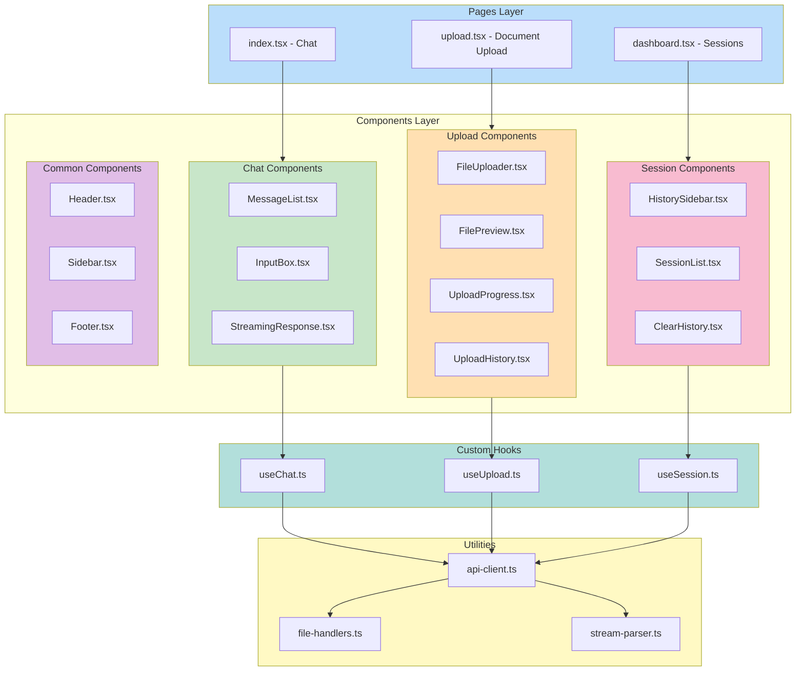

---

## 3. Backend Module Architecture

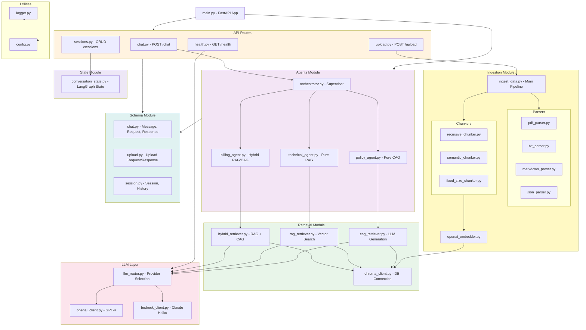

---

## 4. LangGraph Agent Orchestration Flow

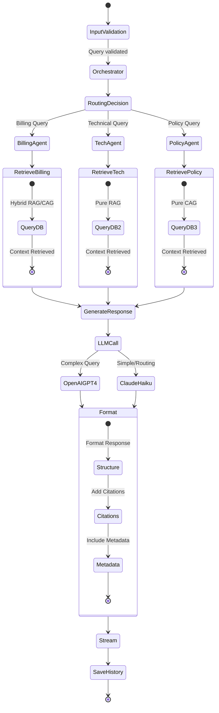

---

## 5. Document Ingestion Pipeline

```mermaid
flowchart LR
    subgraph Input[Input Stage]
        User[User Selects Multiple Files]
        Frontend[Frontend Upload UI]
    end
    
    subgraph Processing[Processing Stage]
        Validation[File Validation]
        Parsing[Document Parsing]
        Chunking[Chunking Engine]
    end
    
    subgraph Generation[Generation Stage]
        Embedding[Embedding Generation]
        Metadata[Metadata Enrichment]
    end
    
    subgraph Storage[Storage Stage]
        Routing[Route to Collection]
        ChromaStore[Store in ChromaDB]
        Verification[Verification]
    end
    
    Output[Ingestion Complete]
    
    User --> Frontend
    Frontend --> Validation
    Validation --> Parsing
    Parsing --> Chunking
    Chunking --> Embedding
    Embedding --> Metadata
    Metadata --> Routing
    Routing --> ChromaStore
    ChromaStore --> Verification
    Verification --> Output
    
    style Input fill:#e3f2fd
    style Processing fill:#f3e5f5
    style Generation fill:#fce4ec
    style Storage fill:#e8f5e9
    style Output fill:#c8e6c9
```

---

## 6. Chat Query Data Flow

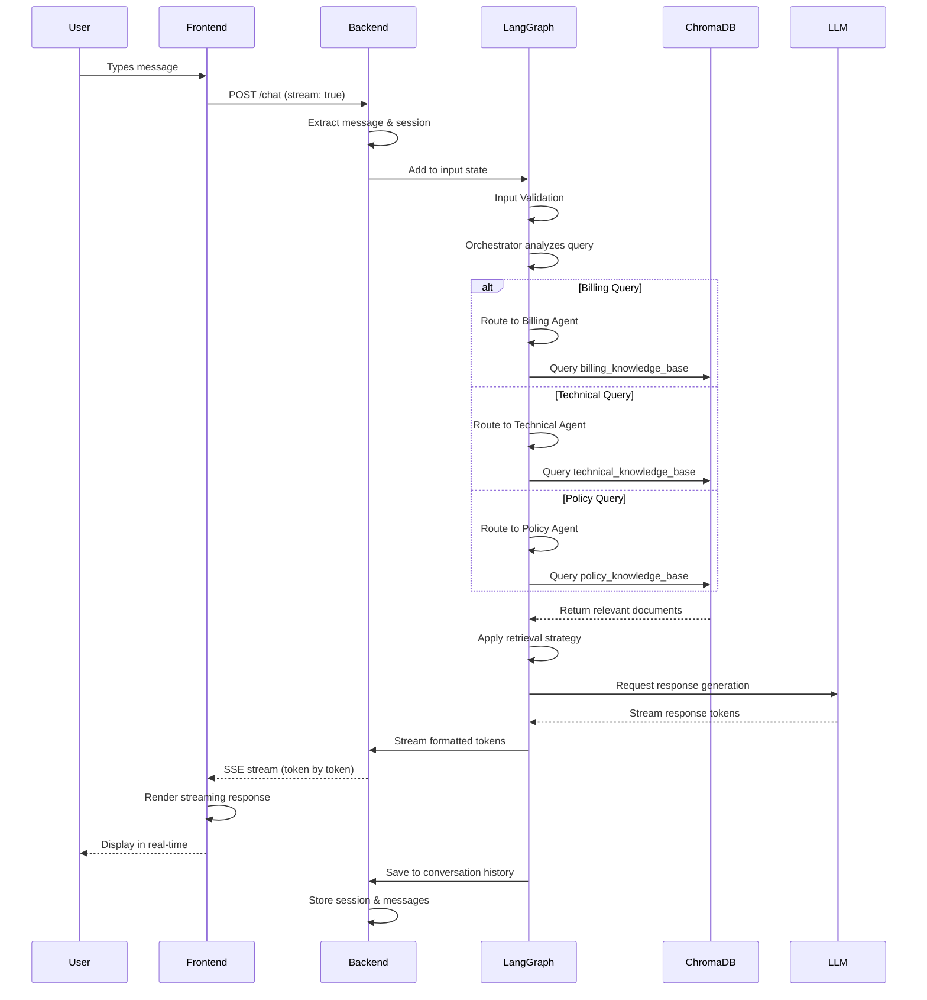

---

## 7. Document Upload Data Flow

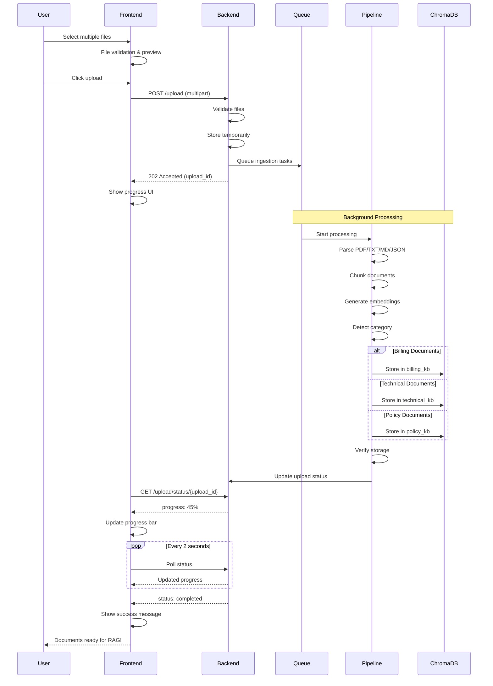

---

## 8. Vector Database Collections

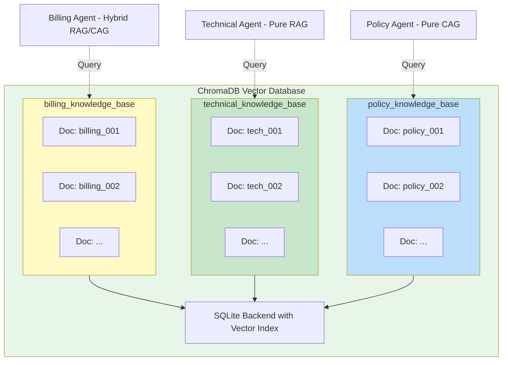

---

## 9. Retrieval Strategy Comparison

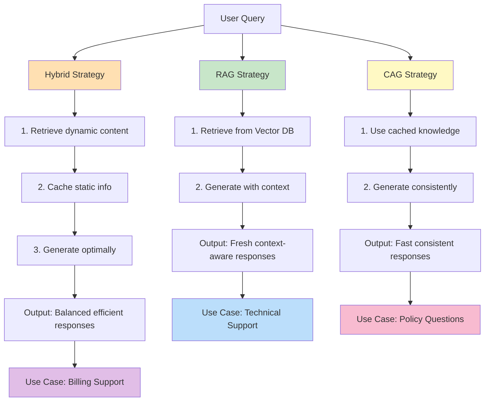

---

## 10. LLM Provider Selection Strategy

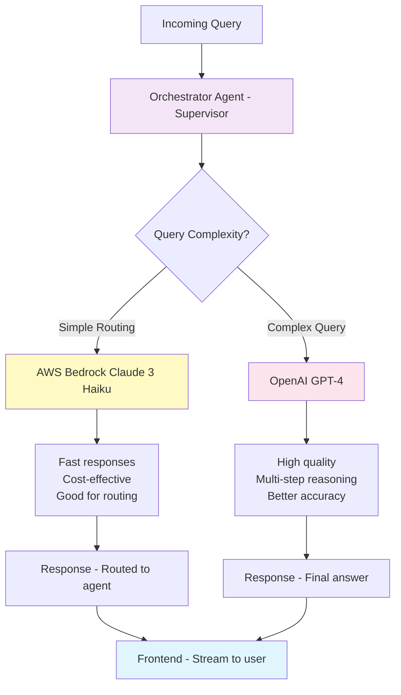

---

## 11. API Endpoints Architecture

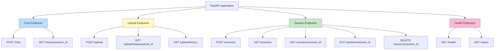

---

## 12. Complete System Integration

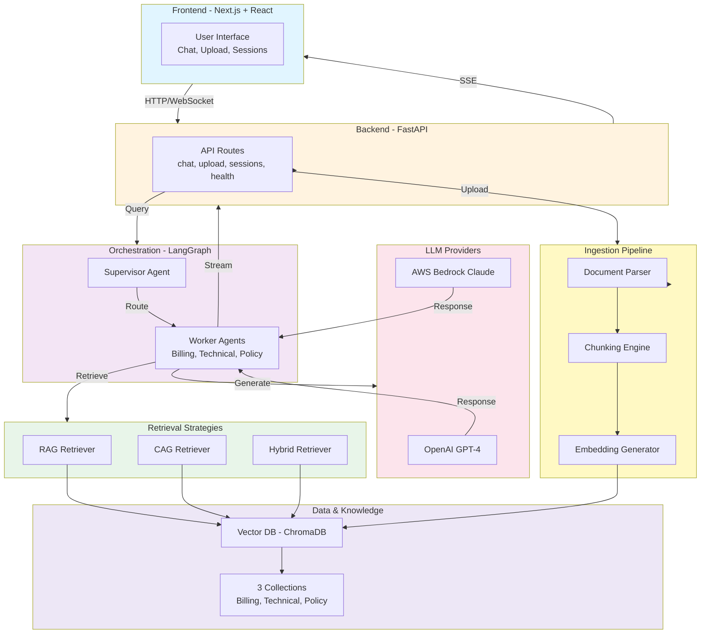

---

## Summary of Diagrams

| # | Diagram | Type | Purpose |
|---|---------|------|---------|
| 1 | High-Level System | Graph | Complete system overview with all major components |
| 2 | Frontend Architecture | Graph | Next.js component structure and organization |
| 3 | Backend Architecture | Graph | FastAPI modules and layer organization |
| 4 | LangGraph Flow | State Diagram | Agent orchestration and state machine |
| 5 | Ingestion Pipeline | Flowchart | Document processing workflow |
| 6 | Chat Query Flow | Sequence | User query processing interaction |
| 7 | Upload Flow | Sequence | Document upload interaction |
| 8 | Vector DB Collections | Graph | ChromaDB structure and organization |
| 9 | Retrieval Strategies | Graph | Comparison of RAG vs CAG vs Hybrid |
| 10 | LLM Selection | Graph | Provider selection logic |
| 11 | API Endpoints | Graph | All API endpoints organized by category |
| 12 | System Integration | Graph | Complete integrated system overview |

---

## Notes on Rendering

These Mermaid diagrams are compatible with:
- ✅ **GitHub** - Renders automatically in markdown files
- ✅ **GitLab** - Native Mermaid support
- ✅ **Mermaid Live Editor** - https://mermaid.live
- ✅ **VS Code** - With Mermaid Preview extension
- ✅ **Notion** - Use Mermaid embed blocks
- ✅ **Confluence** - With Mermaid plugin

If you encounter rendering issues on a specific platform, try:
1. Removing emojis from subgraph labels
2. Simplifying node labels
3. Using the Mermaid Live Editor to test and debug
